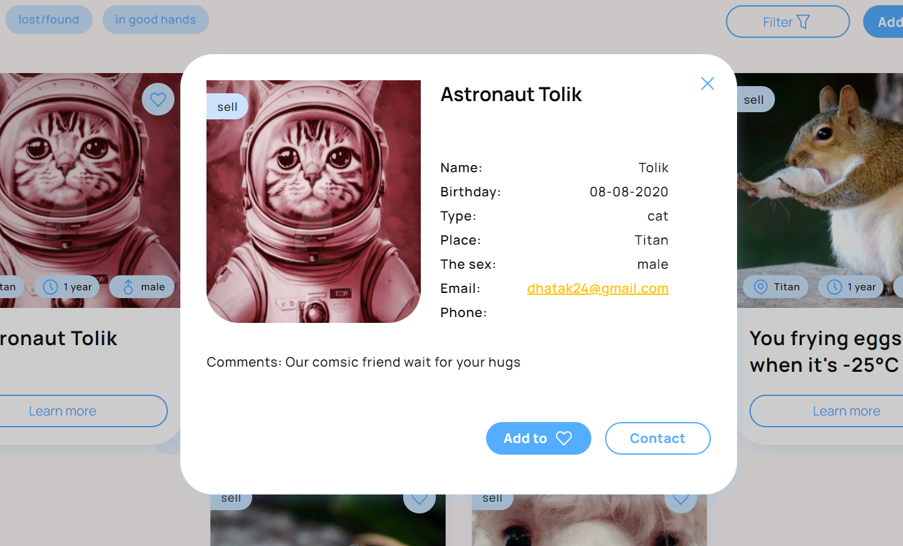
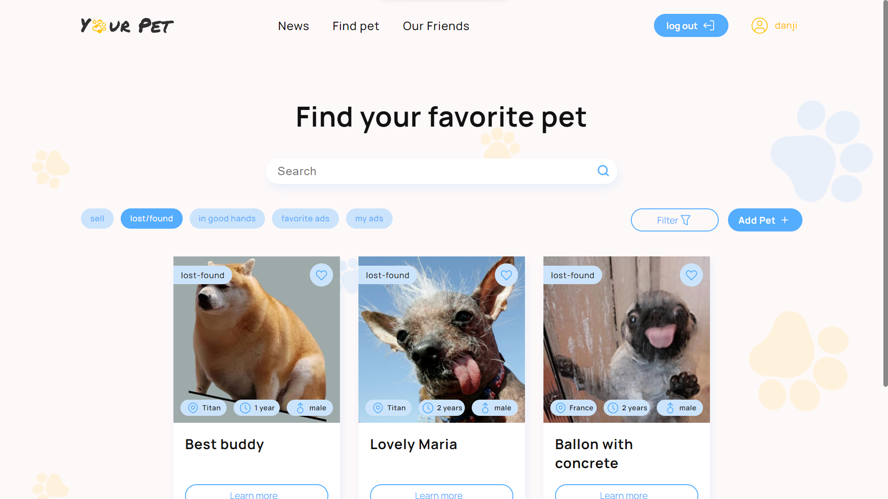
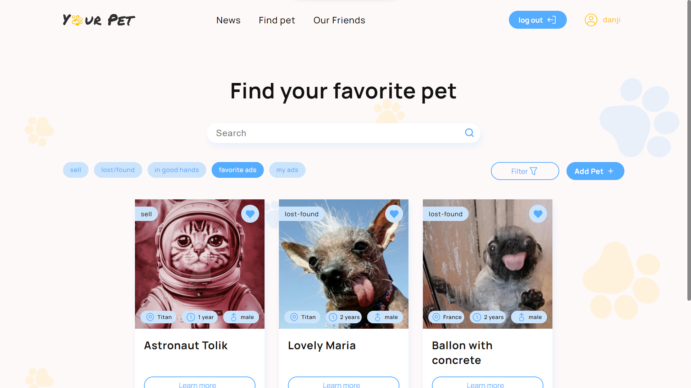

  

  
  
  
  

Table of Contents

- [Description](#description)
  - [Functionalities](#using-this-application-you-can)
- [Built with](#built-with)
- [Usage](#usage)
  - [Main page](#main-page)
  - [Find pet page](#find-pet-page)
  - [Registration page](#registration-page)
  - [Authorization page](#authorization-page)
  - [Profile page](#profile-page)
    - [Personal information](#personal-information)
  - [Adding pet page](#adding-pet-page)
  - [News page](#news-page)
  - [Our friends page](#our-friends-page)
- [Contributing](#contributing)

## Description

`Your Pet` is the client-side `adaptive` web application for any device screen,
created for pet lovers by a team of `12 developers` with the help of `React` and
`Redux` libraries.

For this project, a `REST API` was also created with `Node.js` and `Express.js`
framework on a
[separate repository](https://github.com/NEYROSICK/GoIT-Team-03-Node-API) and
uploaded to [render.com](https://goit-team-03-node.onrender.com/).

> [!IMPORTANT] 
> Due to the use of the `free version` of the Render hosting service, it may take some time before you can `access the backend`, for example, to view cards in the catalog, or to register your private account.

### Using this application you can:

- View cards with information about various pets 🐾
- Filter cards by 3 categories:
  - Pets for sell 💲
  - Lost/found pets 🔍
  - Pets in good hands 🎁
- Filter pets by age or sex ♀️ ♂️
- Load more cards by clicking on the next page button 🔄
- learn more about those pets you are interested in 📖
- Add selected pets to your favorites🤍
- Register your own user account 💻
- Create/delete your own adverts for pets 📱
- Add your personal pets to your user profile page 🐱
- Read news about pets 📰
- Learn more about 'Your pet' partners 🤝

## Built With

  

## Usage

To open this web application, you need to navigate to
[the embedded link](https://neyrosick.github.io/GoIT-Team-03-React-Frontend/) or
follow the link in the description of the repository.

### Main Page

The first thing you encounter is the `main page` screen.

Here, you can see a `header` with `navigation` links: the logo (`main page`)
link, `the news` link, `find pet` link, and `our friends` link. Additionally,
there are links for `authorization`, where you can register or log in if you
already have an account.

### Find Pet Page

On this page you can view adverts with information about various pets.

You can find an advert by a title using the search bar in the top of the page.
Also you can filter adverts by 3 categories: pets `for sell`, `lost or found`
pets, pets `in good hands`. Furthermore you can `filter` adverts by `sex` or
`age`.

On every card you will encounter `image` of pet, `title` of card, information
about `age`, `sex` and `location` of pet, `category` of advertisement,
`learn more button` and add to `favorites` button.

By clicking on `learn more` button, the modal window with an additional
information about selected pet will appear on your screen.

If you attempt to add a pet advert using the corresponding button or to add an
advertisement to your favorites by clicking on the heart button in the corner of
this advert or modal window with detailed info while being unauthorized (not
logged in), you will encounter a next `warning message`.

Using the links below the authorization warning message, you can `register` your
account or `authorize` if you already have an existing one.

This is how the page would look if you were `authorized`

As you can see, now there are 5 filter tabs instead of 3 as it was before
authorization.

Now when you click on the button with the heart icon it will add selected advert
to your `favorites`.

Clicking the `heart button again` in the favorites section or any other
tab/modal window while it is glowing blue will `remove` the ad from the
favorites tab.

In the `My Ads` tab, you can find every advertisement that was added from your
account, spanning across all categories.

If you want to `remove` an `advertisement` you created, simply locate it using
the search bar or scroll. Then, click on the `trash bin button` to delete it
from the platform, even if this advert was in somebody's favorites. This ensures
that nobody will see your advert again.

### Registration Page

If you clicked on the `Registration` button in the popup window, or in the
header of the website you will navigate to the `registration page`.

Here you can create your own private account to get more access to the web
application features. If email is already in use, or if password is not passing
the validation you will be warned to change credentials.

### Authorization Page

If you clicked on the `Log in` button in the popup window, or in the header of
the website, you will navigate to the `authorization page`.

Here you can authorize if you already have registered personal account.

### Profile Page

After succesful authorization or registration you will be redirected to the
`Profile Page`

In this page you can see your `personal information` and `your own pets` that
are shown only from this page and only for you.

You can also navigate to this page using `profile page link` which appears in
header section after succesful authorization. It has your name and user icon
inside itself.

### Personal Information

You can change your personal information and add an image to your profile by
clicking on pencil icon in right top corner of `My information` section and
adding necessary information.

  

By the way, you can exit from your account using the Log Out button in
`My information` section

### Adding pet page

You can add your own pets to your personal page, or an advertisment that
everyone can see for 3 different categories. Simply click on the `Add pet`
button in the profile page or in the catalog page. Then you will be redirected
to `Adding pet page` with a web form

Let's add our own pet, that is private and hidden from everyone. After
succesfull uploading information about a new pet we will automatically
redirected to the `profile page` and now we can see a new pet card appears in
list of our own pets.

You can `remove` pets from your profile page if necessary by clicking on the
button with the trashbin icon.

If there are no single pet in your profile page you will encounter corresponding
`message`

### News page

Clicking on the `News` link in the header's navigation will take you to the
dedicated news page. Here, you can explore articles and updates about the world
of pets.

### Our friends page

By clicking on the `Our Friends` link in the header's navigation, you'll be
directed to dedicated partner's page. Here, you can find more information about
'Your Pet' partners or get in touch with them directly through `phone` or
`email`.

## Contributing

  <a href="https://github.com/neyrosick/GoIT-Team-03-React-Frontend/issues/new?assignees=&labels=bug&template=01_BUG_REPORT.md&title=bug%3A+">Report a Bug</a>
  ·
  <a href="https://github.com/neyrosick/GoIT-Team-03-React-Frontend/issues/new?assignees=&labels=enhancement&template=02_FEATURE_REQUEST.md&title=feat%3A+">Request a Feature</a>
  ·
  <a href="https://www.linkedin.com/in/danylohatak/">Ask a Question</a>

First off, thanks for taking the time to contribute! Contributions are what
makes the open-source community such an amazing place to learn, inspire, and
create. Any contributions you make will benefit everybody else and are greatly
appreciated.

Please try to create bug reports that are:

- _Reproducible._ Include steps to reproduce the problem.
- _Specific._ Include as much detail as possible: which version, what
  environment, etc.
- _Unique._ Do not duplicate existing opened issues.
- _Scoped to a Single Bug._ One bug per report.

Your contributions are always welcome

  <a href="#description">(Back to top)</a>

