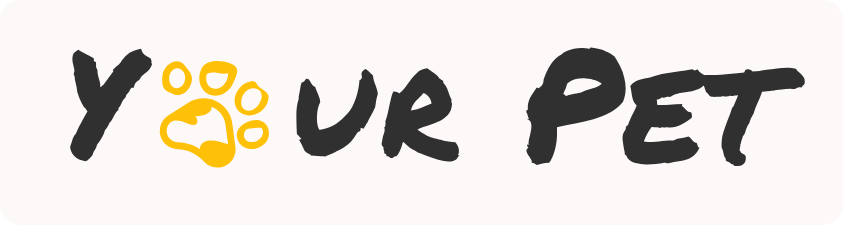

  

  
  
  
  

## Description

Your Pet is the client-side web application created for pet lovers by a team of
12 developers with the help of React and Redux libraries. For this project, a
[REST API](https://github.com/NEYROSICK/GoIT-Team-03-Node-API) was also created
on Node.js and Express.js framework on
[separate repository](https://github.com/NEYROSICK/GoIT-Team-03-Node-API) and
uploaded on [render.com](https://goit-team-03-node.onrender.com/).

**Using this application you can:**

- View cards with information about various pets 🐾
- Filter cards by 3 categories:
  - Pets for sell 💲
  - Lost/found pets 🕵️
  - Pets in good hands 🎁
- Filter pets by age or sex ♀️ ♂️
- Load more cards by clicking on the next page button 🔄
- learn more about those pets you are interested in 📖
- Add selected pets to your favorites🤍
- Register your own user account 💻
- Create/delete your own adverts for pets 📱
- Add your personal pets to your user profile page 🐱
- Read news about pets 📰
- Learn more about 'Your pet' partners 🤝
